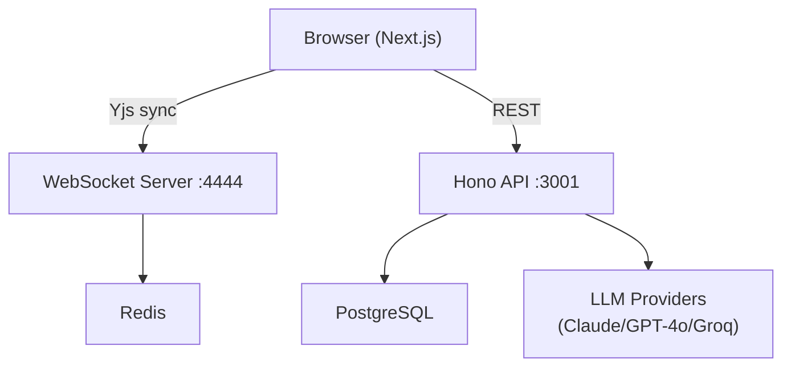

# MindLink

```
  __  __ _           _ _     _       _
 |  \/  (_)_ __   __| | |   (_)_ __ | | __
 | |\/| | | '_ \ / _` | |   | | '_ \| |/ /
 | |  | | | | | | (_| | |___| | | | |   <
 |_|  |_|_|_| |_|\__,_|_____|_|_| |_|_|\_\
```

**The first multiplayer workspace where humans and AI agents collaborate simultaneously.**

Not a chatbot. Not a copilot. A team member.

## Features

- 🤝 **Real-time collaboration** — Yjs-powered sync across all clients
- 🤖 **6 built-in AI agents** — Sage, Spark, Lens, Atlas, Echo, Ghost
- 💬 **Agent-to-agent debates** — Agents reference and respond to each other
- 📝 **6 workspace modes** — Document, Code, Brainstorm, Code Review, Writing, Architecture
- 🗳️ **Voting system** — Structured decision-making with auto-logged outcomes
- 🔧 **Custom agent builder** — Create agents with personality sliders and behavior rules
- 🔒 **GitHub OAuth** — One-click authentication

## Tech Stack

| Layer | Technology |
|---|---|
| Frontend | Next.js 15, React 19, TailwindCSS 4, Framer Motion |
| Editors | Tiptap (document), Monaco (code), Excalidraw (whiteboard) |
| Real-time | Yjs, y-websocket, y-monaco |
| Backend | Hono, Node.js, Prisma, PostgreSQL |
| Cache | Redis, BullMQ |
| Auth | NextAuth.js v5, GitHub OAuth |
| LLM | Anthropic Claude, OpenAI GPT-4o, Groq |
| Monorepo | Turborepo, pnpm workspaces |

## Quick Start

**Prerequisites:** Node 20, pnpm, Docker

```bash
# 1. Clone and install
git clone https://github.com/YOUR_GITHUB_USERNAME/mindlink
cd mindlink
pnpm install

# 2. Configure environment
cp .env.example .env
# Edit .env with your API keys and OAuth credentials

# 3. Start database services
pnpm db:up

# 4. Run migrations and seed agents
pnpm db:migrate
pnpm db:seed

# 5. Start all services
pnpm dev
```

Open [http://localhost:3000](http://localhost:3000).

## Environment Variables

See `.env.example` for all required variables. Key ones:

| Variable | Description |
|---|---|
| `DATABASE_URL` | PostgreSQL connection string |
| `REDIS_URL` | Redis connection string |
| `ANTHROPIC_API_KEY` | Claude API key |
| `OPENAI_API_KEY` | OpenAI API key |
| `GROQ_API_KEY` | Groq API key |
| `GITHUB_CLIENT_ID` | GitHub OAuth app client ID |
| `GITHUB_CLIENT_SECRET` | GitHub OAuth app client secret |
| `NEXTAUTH_SECRET` | Random secret for session signing |

## Monorepo Structure

```
mindlink/
├── apps/
│   ├── web/          # Next.js 15 frontend (port 3000)
│   └── server/       # Hono API + Yjs WS server (ports 3001, 4444)
├── packages/
│   ├── ui/           # Shared React components
│   ├── types/        # Shared TypeScript types
│   ├── agents/       # Agent configs, templates, demo script
│   └── config/       # Shared ESLint + tsconfig
├── docker/
│   └── docker-compose.yml
└── turbo.json
```

## Available Scripts

| Command | Description |
|---|---|
| `pnpm dev` | Start all apps in development mode |
| `pnpm build` | Build all apps for production |
| `pnpm db:up` | Start Docker services (PostgreSQL + Redis) |
| `pnpm db:migrate` | Run Prisma migrations |
| `pnpm db:seed` | Seed built-in agents |
| `pnpm typecheck` | Type-check all packages |

## AI Agents

| Agent | Role | Provider | Specialty |
|---|---|---|---|
| **Sage** | Senior Architect | Claude | System design, trade-offs |
| **Spark** | Creative Ideator | GPT-4o | Brainstorming, unconventional ideas |
| **Lens** | Code Reviewer | Groq | Bug detection, code quality |
| **Atlas** | Project Manager | Groq | Scope, estimates, prioritization |
| **Echo** | User Researcher | GPT-4o | UX, user needs, simplicity |
| **Ghost** | Security Auditor | Claude | Vulnerabilities, threat modeling |

## Contributing

1. Fork the repository
2. Create a feature branch: `git checkout -b feature/my-feature`
3. Make your changes and commit: `git commit -m 'Add my feature'`
4. Push to the branch: `git push origin feature/my-feature`
5. Open a Pull Request

## Architecture



## License

MIT © MindLink Contributors
